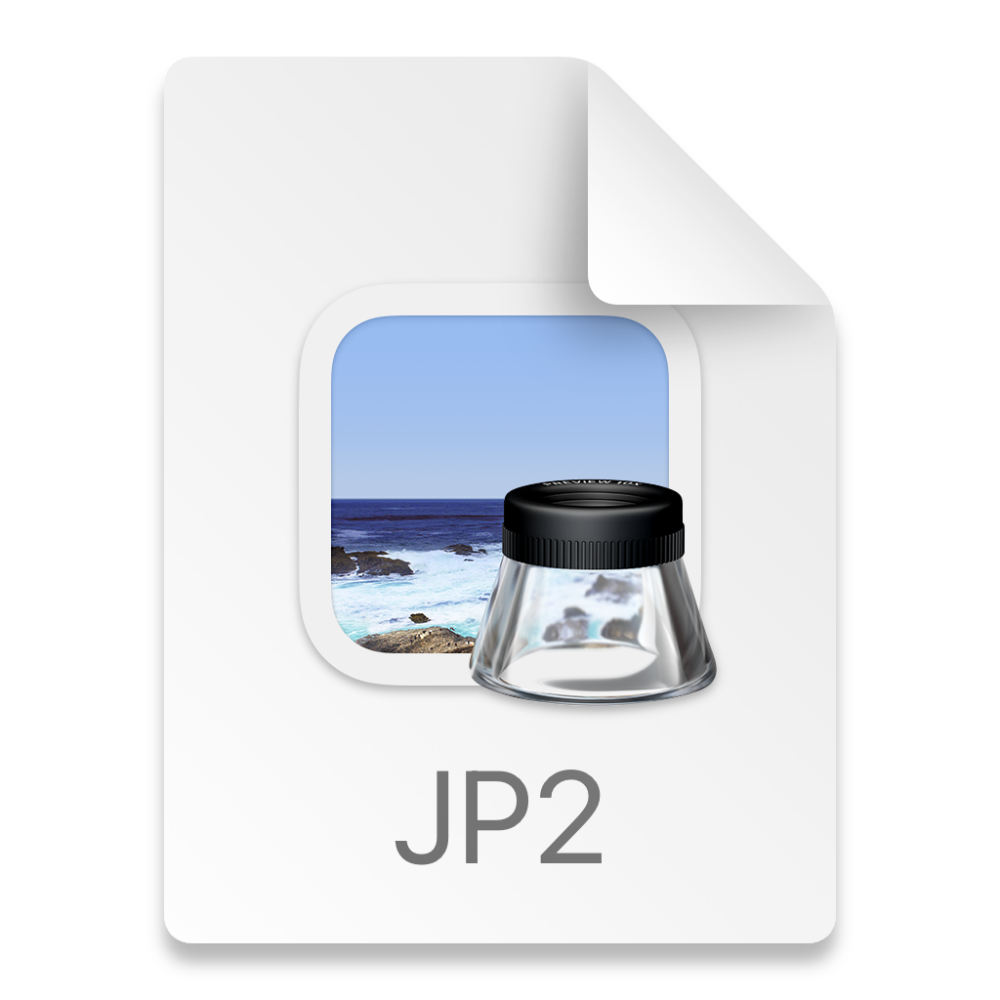

JavaScript: Password Generator

# Project Description
This application generates a new password that is between 8 and 128 characters in length, composed of a random mix of numeric, uppercase, lowercase, and/or special characters. The user will get prompted to try again if they fail to enter a numeric value between 8 and 128.

### Website Link
https://kimberlypark.github.io/password-generator/
)

Built With
* HTML
* CSS
* JavaScript